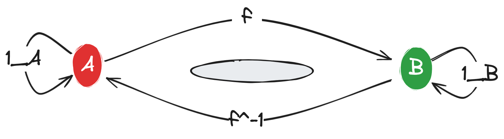

# **Morphisms**

In this sectoin we go deeper into the concept of morphisms in category theory and will discuss specicfic examples in Mathematics and Programming.

**Morphism** are the conntections between the objects of a category and they basically define what the category should be. 

**In mathematics** morphism are usually some kind of functions/mappings which preserve the inner structure of the objects. However, in general the objects in the category can be anything and do not need to have an inner construction. Rather, the idea is that the object themselves are *"`defined`"* by the morphisms that connect them to other objects.

**In programming**, morphisms are usually functions that map between types. 

In what follows we will discuss the different types of morphisms and their properties and analyse specific examples in Mathematics and Programming.

## **Types of Morphisms**

There are several types of morphisms in category theory. The most common ones are:

1. **Endomorphisms**: These are morphisms that map an object to itself. In other words, the source and target of the morphism are the same object. In programming, endomorphisms are functions that map a type to itself.

2. **Isomorphisms**: These are morphisms that have an inverse. In other words, there exists another morphism that maps the target back to the source. In programming, isomorphisms are functions that have an inverse.

  
    

    
    

3. **Monomorphisms**: These are morphisms that are left-cancellative. In other words, if two morphisms have the same target and when composed with another morphism give the same result, then the two morphisms are equal. In programming, monomorphisms are functions that are injective.

4. **Epimorphisms**: These are morphisms that are right-cancellative. In other words, if two morphisms have the same source and when composed with another morphism give the same result, then the two morphisms are equal. In programming, epimorphisms are functions that are surjective.

> **Isomorphisms** are hence morphisms that are both monomorphisms and epimorphisms. In other words, they are both injective and surjective.

5. **Automorphisms**: These are morphisms from an object to itself that are both endomorphisms and isomorphisms, i.e. thay are isomorphism from an object to itself.

The above notions could be familiar from group theory and algebra, the above are generalizations of the same concepts to categories.
We will see that these concepts will correspond to the corresponding concets in algebra for the category of Groups, Rings, Modules, etc.